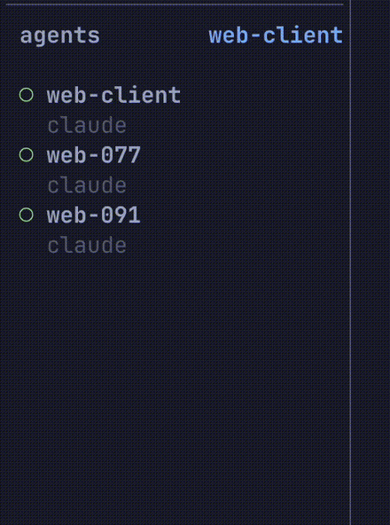

# herdr-project-filter

[](https://github.com/bshearrer/herdr-project-filter/actions/workflows/test.yml)
[](LICENSE)


<p align="center">
  <a href="#install">install</a> · <a href="#keys">keys</a> · <a href="#how-projects-are-detected">detection</a> · <a href="#behavior">behavior</a> · <a href="#what-it-touches">what it touches</a> · <a href="#troubleshooting">troubleshooting</a>
</p>

**Scope herdr's Agents sidebar to one git repository at a time.** Press a key and the panel
drops from every agent you're running to just this project's. Press it again for the next
project. A repo's main checkout and all of its git worktrees count as one project, so five
agents spread across five worktrees of the same repo read as one group, not five unrelated rows.

At four or five agents the Agents panel is perfect. At twelve it's a flat list spanning
unrelated codebases, and an agent blocked on the project you're *not* in is noise. This gives
you the four-agent panel back, on demand, without closing anything.



*Pick a project and the Agents panel filters to it immediately — seven agents down to three. The
Spaces tree above shows why those three belong together: `api-104` and `api-118` are worktrees of
`api-server`. The header label and the panel divider turn accent-colored while a scope is active.*

## Requires

- **herdr ≥ 0.8.2** — the `agent.view.set` API landed in 0.7.5; 0.8.2 is the tested floor.
- **Node ≥ 20.**
- **Linux or macOS.** Windows is untested and unclaimed.

No dependencies, no build step, no configuration file.

## Install

```bash
herdr plugin install bshearrer/herdr-project-filter
```

Then add the keys — herdr does not bind plugin actions automatically:

```toml
[[keys.command]]
key = "prefix+a"
type = "plugin_action"
command = "project-filter.cycle"
description = "cycle project filter"

[[keys.command]]
key = "prefix+shift+a"
type = "plugin_action"
command = "project-filter.pick"
description = "pick project filter"
```

Both chords are unbound in herdr's default keymap, which is why they were chosen. Reload with
`herdr server reload-config` or `prefix+shift+r`.

**To update**, reinstall. Your keybindings live in your own `config.toml` and are untouched:

```bash
herdr plugin uninstall project-filter && herdr plugin install bshearrer/herdr-project-filter
```

**To remove it**, use whichever matches how you added it, then delete the two key blocks:

```bash
herdr plugin uninstall project-filter   # installed from GitHub
herdr plugin unlink project-filter      # linked locally
```

Clearing the view first isn't necessary — herdr drops a plugin's view when the plugin is
disabled or unlinked.

**For local development**, link a working copy instead of installing a release:

```bash
herdr plugin link <path>
```

## Keys

| Key | Action | Does |
| --- | --- | --- |
| `prefix+a` | `project-filter.cycle` | Step: unfiltered → each project → `untracked` → unfiltered |
| `prefix+shift+a` | `project-filter.pick` | Open a picker listing every project with live agent counts |
| — | `project-filter.clear` | Return to unfiltered directly. Bound to nothing by default |

The picker is a popup — arrows or `j`/`k` to move, Enter to apply, Escape to cancel. It shows
how many agents each project has and how many are waiting on you, so you can decide whether a
project is worth switching into before you switch into it.


`✓` marks the scope currently applied; `›` is your cursor.

## How projects are detected

Workspaces that share a `worktree.repo_key` are one project — a repository's main checkout and
every git worktree linked to it, shown under that repo's name. Workspaces with no worktree
record fall into a catch-all group named `untracked`.

Detection is entirely automatic. There is nothing to configure and nothing to keep in sync: open
a new worktree and it joins its project's group on the next event.

## Behavior

**You always know when it's on.** herdr renders the active scope's name in the Agents panel
header, in the accent color, where the `grouped` sort label normally sits — and turns the divider
between the Spaces and Agents panels accent-colored. A scope with no matching agents shows
`no matching agents` rather than an empty panel.

**Rows don't move under your cursor.** Inside a scope the list keeps sidebar order, matching the
Spaces panel above it. That's deliberate: herdr's attention ranking counts whether an agent has
been *seen*, and focusing one marks it seen — so an attention-sorted list rearranges itself the
moment you click it. Every row still carries its state icon, so nothing is lost.

**Every session starts unfiltered.** herdr's `[[startup]]` entrypoint resets the state and clears
the view on launch. The scope is deliberately not restored across restarts: you start each session
seeing everything, and narrow from there.

## What it touches

Worth knowing before you install anything from an unreviewed index:

- **It never modifies your workspaces, panes, or repositories.** It makes exactly four herdr calls:
  two reads (`workspace.list`, `agent.list`) and one display projection
  (`agent.view.set` / `agent.view.clear`). It has no write access to anything else.
- **It launches one subprocess: the `herdr` CLI itself.** `project-filter.pick` shells out to
  `herdr plugin pane open` to open the picker popup, resolved from `HERDR_BIN_PATH` (falling back
  to `herdr` on `$PATH`). That is the only process it ever spawns.
- **It writes one small state file** — a few bytes of cycle position, in the state directory herdr
  hands it. Written atomically via a temp file in that same directory, so a concurrent reader never
  sees a half-written file. Nothing outside that directory is touched.
- **It sends nothing anywhere.** No network calls, no telemetry.
- **Zero runtime dependencies.** Node builtins only, so there is no supply chain beyond Node
  itself and no build step to audit.
- **It cannot clear another plugin's view.** Every `agent.view.clear` it sends carries this
  plugin's `source`, and herdr ignores a clear whose source doesn't match the active view's owner.
  (Setting a view is not source-checked — see the first limitation below.)

## Known limitations

- **One view at a time.** herdr holds exactly one agent view globally, and setting a view is not
  source-checked — so this plugin and any other view-setting plugin (`herdr-island`,
  `herdr-last-used`) will replace each other's view. Only one can be in effect at once. Clearing
  *is* source-checked, so neither can clear the other's.
- **Very narrow popups truncate.** Every line the picker draws is clamped to the pane width, so
  nothing ever wraps — but below roughly 20 columns the clamp starts cutting into the count column.
  The waiting flag and the active marker drop first; the project name and its count go last.

## Troubleshooting

herdr pipes plugin output rather than displaying it, so this is the only place errors surface:

```bash
herdr plugin log list --plugin project-filter
```

If a keypress does nothing, check the actions registered:

```bash
herdr plugin action list --plugin project-filter   # expect cycle, clear, pick
```

If `prefix+a` is already bound in your `config.toml`, the later definition wins — pick another
chord rather than keeping both.

## Development

Zero runtime dependencies, no build step:

```bash
npm test
```

Three constraints in herdr's view API shape most of this design, and are worth knowing
before changing it. As of herdr 0.8.2: there is no repo field to filter on, so repositories
are resolved to explicit workspace IDs; there is no `agent.view.get`, so the cycle position
is stored locally rather than read back; and herdr holds one view at a time, globally.

## License

MIT — see [LICENSE](LICENSE).

herdr is a separate project, licensed AGPL-3.0. This plugin is an independent work that talks to
herdr over its plugin socket; it is not affiliated with or endorsed by the herdr project.
